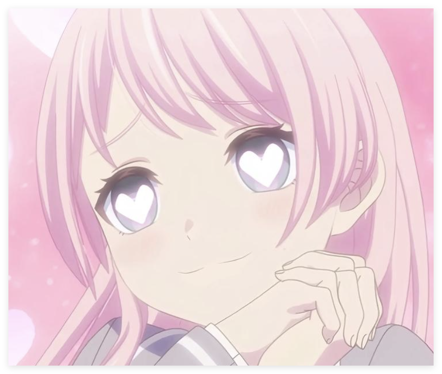

# MyGO!!!!! Member Recognizer 🎸

这是一个基于CNN的轻量级图像识别项目，旨在识别 **MyGO!!!!!** 中的五位成员。

## 实例
- **输入**：

- **输出**：

| File Name             | Top Prediction | Confidence |
|:---------------------|:-------------|:-----------|
| QQ20260201-233236.png | Anon          | 99.10%    |

## 项目特性
- **可视化训练**：支持 TensorBoard 实时监控 loss 与 accuracy 曲线。
- **测试文件**：支持批量识别 ` try_everything `文件夹中的图片。
- **开箱即用**：Release页面中有已经训练好的模型，可以直接调用
- **工程化训练流程**：包含自定义 Dataset、Trainer 封装、自动保存最佳模型。

## 项目局限性
- 只能够识别正脸的照片，并且头占图片的比例应该至少有50%。
- 如果对图片进行色彩上的调整，如加黑白滤镜等，会较大地影响预测的准确率。

## 模型与训练说明
- 自定义 CNN 网络（4 个卷积 block + BatchNorm + Dropout）
- 输入尺寸：128×128
- Loss：CrossEntropy
- Optimizer：Adam
- 学习率调度：ReduceLROnPlateau（基于验证集自动降低学习率）
- 数据增强：随机翻转、旋转、ColorJitter
- 自动保存验证集准确率最高的模型
- 固定随机种子，保证实验可复现


## 环境要求
在开始之前，请确保你的电脑已安装 Python 3.8+。
一键安装所需依赖：
```bash
pip install -r requirements.txt
```

## 数据集
在Release页面下载数据集，并放在指定的目录中开始训练。文件结构如下：
```text
   data/
   ├── pictures_train/
   │   ├── Anon/
   │   ├── Rana/
   │   ├── Soyo/
   │   ├── Taki/
   │   └── Tomori/
   └── pictures_test/
       ├── Anon/
       ├── Rana/
       ├── Soyo/
       ├── Taki/
       └── Tomori/
```


---

# MyGO!!!!! Member Recognizer

A lightweight CNN-based image recognition project designed to identify the five members of the band **MyGO!!!!!**.

## Example
- **Input**：

- **Output**：

| File Name             | Top Prediction | Confidence |
|:---------------------|:-------------|:-----------|
| QQ20260201-233236.png | Anon          | 99.10%    |

## Features
- **Visualized Training**: Real-time monitoring of loss and accuracy curves via TensorBoard.
- **Batch Inference**: Supports batch recognition of images in the `try_everything` folder.
- **Out-of-the-box**: Pre-trained models are provided on the Release page and can be used directly.
- **Engineering-oriented Training Pipeline**: Includes custom Dataset, Trainer abstraction, and automatic best-model saving.

## Limitations
- Only front-facing portraits are supported, and the head should occupy at least 50% of the image.
- Significant color modifications (such as black-and-white filters) may noticeably reduce prediction accuracy.

## Model and Training Details
- Custom CNN architecture (4 convolutional blocks with BatchNorm and Dropout)
- Input size: 128×128
- Loss: CrossEntropy
- Optimizer: Adam
- Learning rate scheduler: ReduceLROnPlateau (automatically reduces learning rate based on validation accuracy)
- Data augmentation: random flip, rotation, and ColorJitter
- Automatically saves the model with the highest validation accuracy
- Fixed random seed for reproducible experiments

## Requirements
Ensure you have **Python 3.8+** installed.
Install dependencies with one click:
```bash
pip install -r requirements.txt
```

## Dataset
To train the model yourself, download the dataset from the [Releases page] and extract it to the root directory. The structure of dataset folder should be like this:
```text
   data/
   ├── pictures_train/
   │   ├── Anon/
   │   ├── Rana/
   │   ├── Soyo/
   │   ├── Taki/
   │   └── Tomori/
   └── pictures_test/
       ├── Anon/
       ├── Rana/
       ├── Soyo/
       ├── Taki/
       └── Tomori/
```
